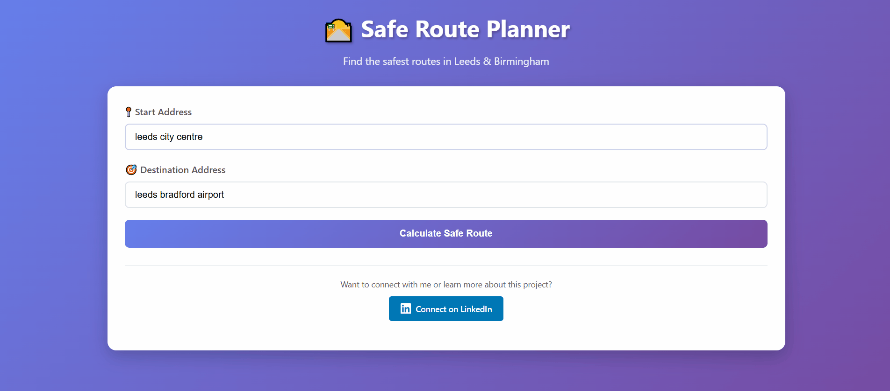

# Safe Route Planner - Leeds & Birmingham

A Flask (& streamlit) web application that finds the safest routes between locations in Leeds and Birmingham using accident crash risk analysis and route optimization.

## Flask Demo


## Streamlit Demo


## Features

- 🛣️ Calculate fastest vs safest routes
- 📊 Risk analysis with visual indicators
- 🗺️ Interactive maps with route comparison
- 📍 Support for Leeds and Birmingham areas
- 🔒 Secure API key management

## Setup Instructions

### 1. Clone the Repository

```bash
git clone <your-repo-url>
cd safe-route-planner
```

### 2. Install Dependencies

```bash
pip install -r requirements.txt
```

### 3. Set up Environment Variables

Create a `.env` file in the root directory:

```bash
cp .env.example .env
```


### 4. Prepare Data Files

Ensure you have the following data files in the `data/` directory:
- `risk_grid.pkl`
- `leeds_network.graphml`
- `birmingham_network.graphml`
- `leeds_edges.pkl`
- `birmingham_edges.pkl`

### 5. Run the Application

```bash
python app.py
```

The application will be available at `http://localhost:5000` for flask and `http://localhost:8501` for streamlit

## Getting a Google Maps API Key

1. Go to the [Google Cloud Console](https://console.cloud.google.com/)
2. Create a new project or select an existing one
3. Enable the Geocoding API
4. Create credentials (API key)
5. Restrict the API key to the Geocoding API for security

## Security Notes

- Never commit your `.env` file to version control
- The `.env` file is already included in `.gitignore`
- Consider restricting your API key by IP address or referrer for production use
- Monitor your API usage to avoid unexpected charges

## Project Structure

```
safe-route-planner/
├── app.py              # Main Flask application
├── streamlit_app.py
├── rout_flask.gif
├── route_streamlit.gif 
├── .gitignore          # Git ignore file
├── requirements.txt    # Python dependencies for the streamlit app
├── README.md          # This file
└── data/              # Data files directory
    ├── risk_grid.pkl
    ├── leeds_network.graphml
    ├── birmingham_network.graphml
    ├── leeds_edges.pkl
    └── birmingham_edges.pkl
```

## Contributing

1. Fork the repository
2. Create a feature branch
3. Make your changes
4. Test thoroughly
5. Submit a pull request

## License

This project is licensed under the GNU General Public License v3.0.

### GPL v3 Summary:
- ✅ Commercial use allowed
- ✅ Modification allowed
- ✅ Distribution allowed
- ⚠️ Must disclose source code
- ⚠️ Same license required for derivatives


## Contact

Connect with me on [LinkedIn](https://www.linkedin.com/in/adediran-adeyemi-17103b114/) for questions or collaboration opportunities.
